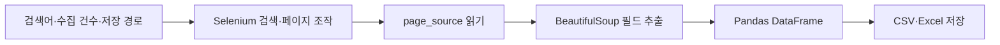

# Python 웹 데이터 수집·분석 실습

Selenium으로 웹페이지를 탐색하고 BeautifulSoup으로 필요한 정보를 추출한 뒤, Pandas로 CSV·Excel 파일을 만드는 교육 캠프 실습 저장소입니다. 이미지 수집과 한글 텍스트 분석·시각화 예제도 포함합니다.

대표 응용은 **한국기술교육대학교 장학금 검색 결과 수집**입니다. 검색 결과의 제목·내용·작성일자를 표로 구성해 저장합니다.

## 대표 수집 흐름



## 노트북 안내

노트북은 모두 [`_05_crawling`](./_05_crawling)에 있습니다. 강의 예제·연습문제·응용 노트북을 함께 보관한 구조이며, 파일명 앞의 `Part` 번호를 따라 기초부터 확인할 수 있습니다.

| 파일·파일명 키워드 | 내용 |
| --- | --- |
| [`web_crawling.ipynb`](./_05_crawling/web_crawling.ipynb) | 한기대 장학금 검색, 번호·제목·내용·작성일자 추출, CSV·XLSX 저장 |
| `Part_2_12` | 브라우저 실행, 검색창 입력, 사이트별 요소 선택 |
| `Part_2_13_1` | BeautifulSoup HTML 파싱 기초 |
| `Part_2_13_2` | RISS 검색·요약정보 추출과 TXT 저장 |
| `Part_2_14`, `Part_2_15` | 페이지 이동, 상세 정보 추출, 폴더 생성과 파일 저장 |
| `Part_2_17` | 이미지 URL 추출과 파일 다운로드 |
| `쿠팡`, `지마켓` | 상품 정보·이미지 수집 실습 |
| `대한민국 구석구석` | 관광 정보 검색·상세 페이지 수집 실습 |
| `네이버 VIEW` | 블로그 검색 결과 수집 및 분석 실습 |
| `Part_3_20` | KoNLPy 명사 추출·빈도 집계·워드클라우드·그래프 |

로그인·카페 게시글 등록을 다루는 별도 `.py` 실습 파일도 있습니다. 데이터 수집 노트북을 실행하는 데 필요한 진입점은 아닙니다.

## 대표 노트북의 입력과 출력

`web_crawling.ipynb`는 검색어를 `장학금`으로 지정하고 수집 건수와 저장 경로를 입력받습니다.

| 출력 컬럼 | 내용 |
| --- | --- |
| 번호 | 수집 순번 |
| 제목 | 검색 결과 제목 |
| 내용 | 검색 결과에 표시되는 본문 요약 |
| 작성일자 | 검색 결과 작성일 |

시간·검색어를 포함한 폴더를 만들고 `utf-8-sig` CSV와 `openpyxl` 기반 XLSX를 저장합니다. 마지막 셀은 Windows COM으로 Excel을 여는 코드도 포함합니다.

## 실행 준비

Python·Jupyter와 Chrome이 필요합니다. 노트북은 Windows 경로와 일부 Windows 전용 코드를 사용합니다. 저장소에는 버전이 고정된 의존성 파일이 없으며, 아래는 코드에서 사용하는 기본 패키지 설치 예시입니다.

```bash
git clone https://github.com/ajh1004ajh00/Crawling.git
cd Crawling
python -m venv .venv
```

Windows PowerShell에서 가상환경의 Python으로 실행합니다.

```powershell
.\.venv\Scripts\python.exe -m pip install notebook selenium beautifulsoup4 pandas openpyxl pywin32
.\.venv\Scripts\python.exe -m notebook
```

한글 텍스트 분석 노트북에는 `konlpy`, `matplotlib`, `wordcloud`, `numpy`와 KoNLPy 실행에 필요한 Java 환경을 추가로 준비합니다.

### 실행 전 수정할 설정

1. `Service("c:/py_temp/chromedriver.exe")`를 설치한 Chrome에 맞는 드라이버 경로로 지정합니다.
2. `c:\py_temp\` 등 저장 경로와 입력 텍스트 파일 경로를 로컬 환경에 맞춥니다. 일부 코드는 문자열로 경로를 연결하므로 끝의 구분자도 확인합니다.
3. 워드클라우드의 한글 폰트 경로를 실제 설치된 폰트로 바꿉니다.
4. 대상 사이트의 현재 HTML에 맞는 CSS 클래스·XPath·링크 문구인지 확인합니다.
5. 필요한 셀을 순서대로 실행합니다. `input()`으로 입력을 기다리는 셀과 브라우저 조작 셀이 있습니다.

## 코드에서 확인할 수 있는 역량

- 검색·클릭·페이지 이동과 HTML 파싱을 연결하는 브라우저 자동화
- 사이트별 제목·가격·날짜·요약 등 필드를 표 형태로 구조화
- 수집 건수에 따른 반복 처리와 결과 폴더·CSV·Excel 생성
- 이미지 URL 다운로드, 한글 명사 추출과 빈도 기반 시각화

## 현재 코드의 재현 범위

이 저장소는 교육 당시의 실습 기록입니다. 사이트 개편에 따른 선택자 변경, 고정 대기 시간, 로컬 경로를 확인한 후 실행해야 합니다.

특히 `web_crawling.ipynb`는 반복문 밖에서 `page_source`와 `soup`을 만든 뒤 페이지를 이동합니다. 여러 페이지를 정확하게 수집하려면 이동 후 HTML을 다시 읽는 처리가 필요합니다. 이 노트북을 중복 제거가 검증된 다중 페이지 수집기로 소개하지 않습니다.

일부 예제의 오래된 Pandas 호출과 Excel 자동 실행은 설치 버전·운영체제에 따라 수정이 필요할 수 있습니다. 로그인·게시글 등록 코드는 외부 쓰기 작업을 포함하므로 전체 파일을 일괄 실행하지 말고 학습할 셀과 기능을 선택합니다.

분석 기준 커밋: **845a9189e268a9aec0356b2cd586b5c79037b716**. 이번 README는 노트북의 코드 셀과 파일 구성을 읽어 작성했으며, 실제 사이트 접속·수집·로그인·게시글 등록은 실행하지 않았습니다.
